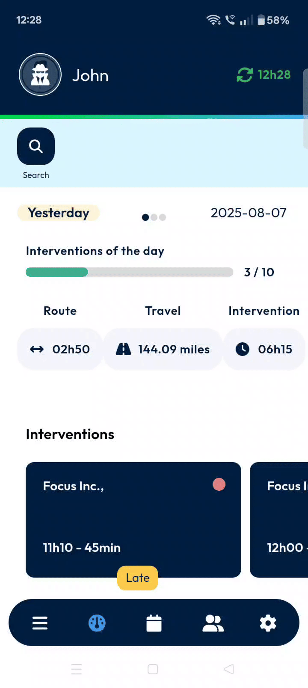
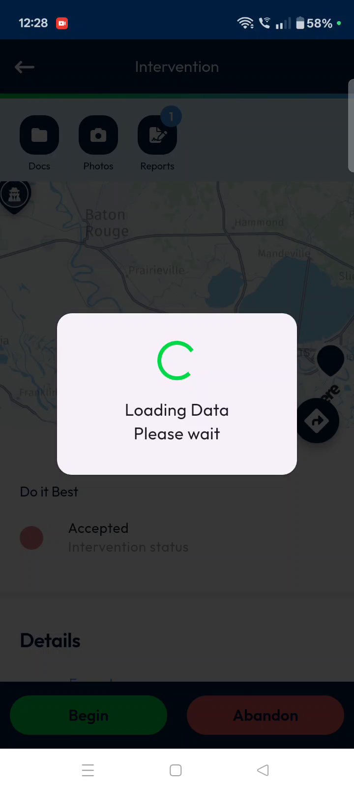
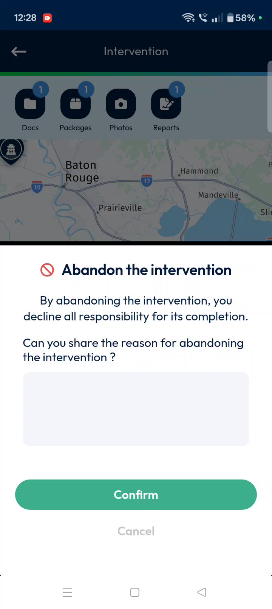
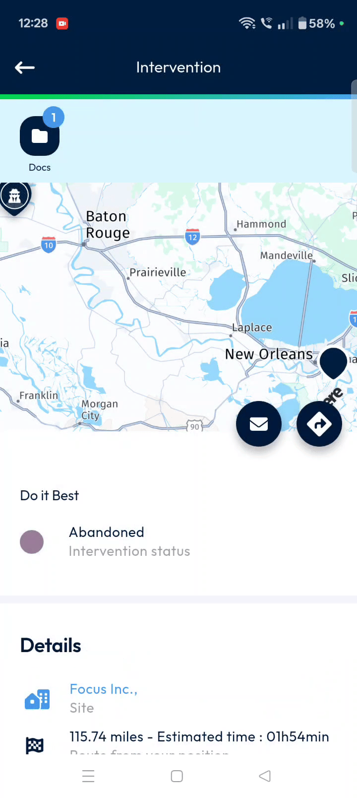

# MainActions-Intervention-Abandon

Welcome to your user guide for **TourSolver Mobile/Intervention-Abandon**! This guide is designed to help you easily manage and, when necessary, abandon interventions within the TourSolver Mobile application. We aim to make this process clear and stress-free, so you can focus on your tasks with confidence.

### Getting Started

Please note that this guide focuses specifically on the "Abandon Intervention" feature. Information regarding system requirements, installation steps, or initial configuration for TourSolver Mobile is not available in the provided sources [i, j].

### Understanding Interventions and Abandonment

In TourSolver Mobile, an "intervention" refers to a task or activity you need to complete. Sometimes, circumstances change, and you might need to cancel or "abandon" an intervention you've started or were about to begin. This guide will walk you through the simple steps to do just that.

### Common Task: Abandoning an Intervention

Before you start a new intervention or abandon an existing one, it's crucial to ensure that you have completed any interventions currently marked as "in progress". You must finish all ongoing interventions before moving on to the next one.

Here’s how to abandon an intervention in TourSolver Mobile:

1.  **Access the Intervention from Your Dashboard**
    *   To begin, you need to open the specific intervention you wish to abandon.

    *   💡 *Tip*: Your dashboard is where you'll find a clear overview of all your scheduled tasks and interventions.
    *   (A screenshot here showing the dashboard with an intervention highlighted would be helpful.)

2.  **Locate and Tap the Abandon Button**
    *   Once you've opened the intervention, if you decide to abandon it, look for the dedicated button.

    *   📹 Timestamp 0:19–0:29 (Intervention-Abandon.mp4): Tapping the **red Abandon button** – A confirmation pop-up window appears.
    *   (A screenshot here clearly showing the red "Abandon" button at the bottom of the screen would be useful. Alternatively, a short GIF demonstrating the tap action and the appearance of the pop-up could be used here.)

3.  **Confirm the Abandonment**
    *   After tapping the abandon button, a pop-up window will appear on your screen to confirm your action. This is a safety measure to prevent accidental abandonments.

    *   📹 Timestamp 0:31–0:36 (Intervention-Abandon.mp4): Tapping **Confirm** – The intervention is processed for abandonment.
    *   (A screenshot here of the confirmation pop-up with the "Confirm" button highlighted would be beneficial. A short GIF showing the pop-up appearing and the user tapping "Confirm" would also be effective.)

4.  **Verify Abandonment**
    *   Once you confirm, the system will process your request.

### Productivity Tips

Specific productivity tips beyond the "Abandon Intervention" process are not provided in the source materials for this guide [i, j]. However, efficiently using the "Abandon" feature as described above helps keep your dashboard tidy and accurately reflects your current workload.

### Conclusion

You've successfully learned how to abandon an intervention in TourSolver Mobile! By following these simple steps, you can confidently manage your tasks and ensure your intervention list stays accurate and up-to-date. Keep exploring TourSolver Mobile to make the most of its features.