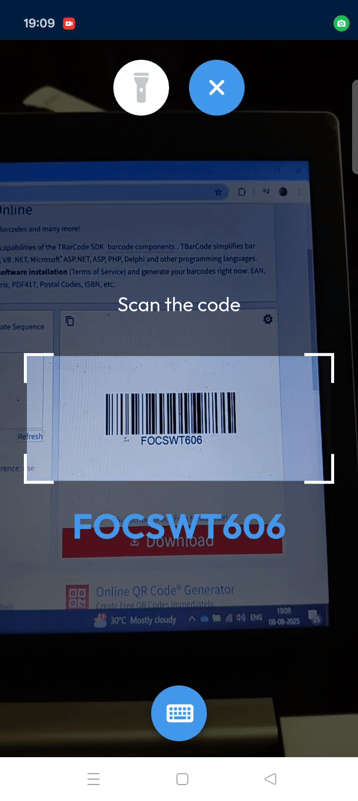
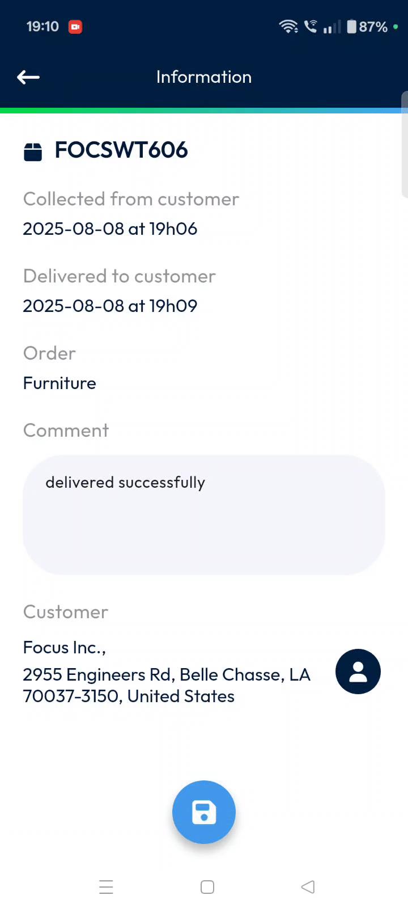
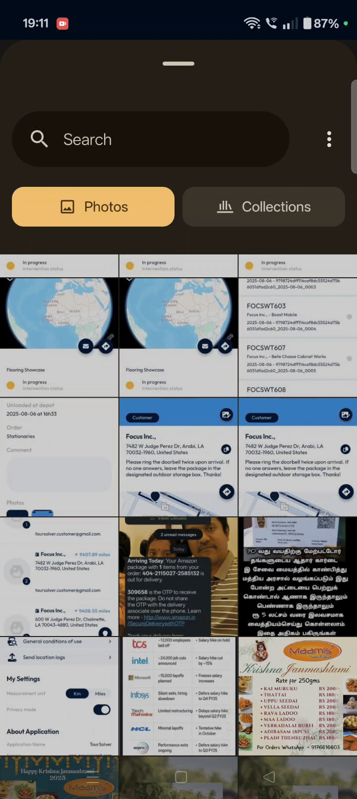
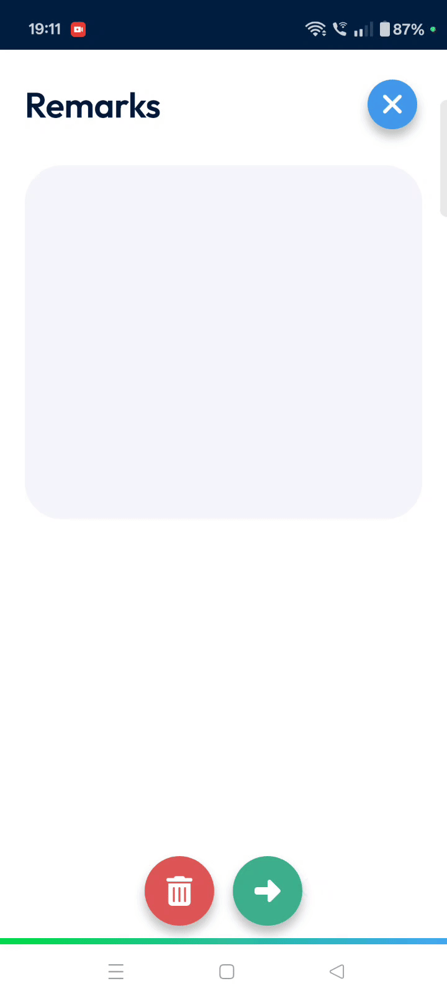
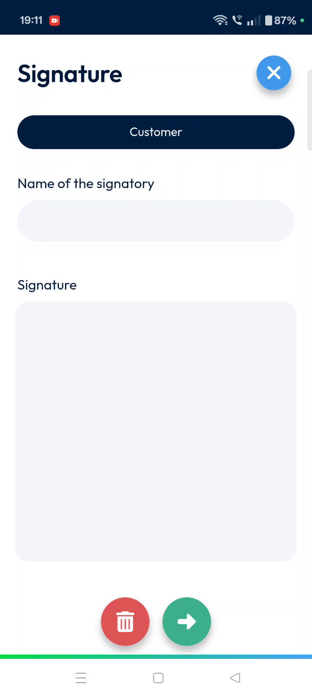
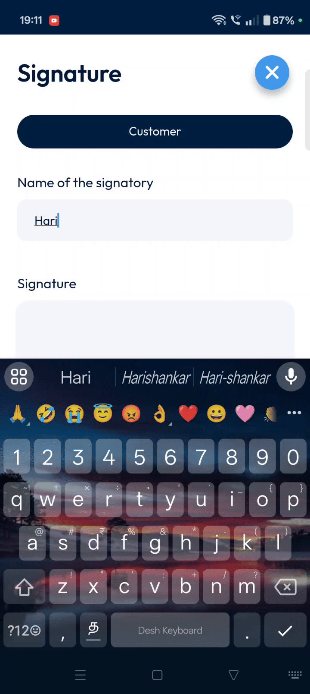

# MainActions-Intervention-Delivery

This user guide will help you master the TourSolver Mobile app for Intervention-Delivery, making your daily tasks straightforward and efficient. By following these steps, you’ll be able to manage interventions, capture crucial information, and ensure smooth operations from the field, all while staying connected with your back office.

***

### 1. Welcome to TourSolver Mobile/Intervention-Delivery!

Welcome to your essential tool for managing field interventions! The TourSolver Mobile app is designed to simplify your delivery and service tasks, allowing you to easily track interventions, manage packages, capture photos, and collect important customer acknowledgements, all in real time. This guide will walk you through every feature, ensuring you feel confident and productive on the go.

***

### 2. Getting Started

To begin using the TourSolver Mobile app, follow these steps.

#### System Requirements & Installation

Please note that specific **system requirements** and **installation/setup steps** for the TourSolver Mobile app are not detailed in the provided sources. You may need to consult additional documentation or your IT administrator for this information.

#### Starting an Intervention

Once the app is installed and you're ready to begin your work, initiating an intervention is simple:

2.  A **confirmation pop-up** will appear.

***

### 3. Understanding Your Interface: Key Features and Benefits

The TourSolver Mobile app’s interface is designed for quick navigation and real-time updates.

**Visual Guidance Placeholder:**
*   [**Suggested Screenshot/Diagram 1: Main Intervention Screen Overview**]: This visual would show the main intervention screen, highlighting the row of navigation icons at the top, the quick access icons, and the intervention details section. This would provide a helpful overview of the interface described below.

#### Navigation Sections (Icons at the Top)

Just below the main navigation icons, you’ll find a row of icons that let you easily jump between different parts of your intervention. Each icon can display a small **blue badge** indicating the number of items added to that section, giving you a quick overview of your progress.

*   **Docs**: Here, you can **upload and view important documents** related to your intervention. This keeps all necessary paperwork organized and accessible.
*   **Packages**: This section allows you to **manage the loading and unloading of packages**, crucial for delivery tasks.
*   **Photos**: Easily **take or upload images** directly from the field, perfect for capturing proof of delivery or site conditions.
*   **Remarks**: Use this area to **enter any comments or notes** pertinent to the intervention.
*   **Reports**: This is where you can **upload the official intervention report**.
*   **Signature**: Capture the **customer's acknowledgement or signature** directly on your device.

#### Quick Access Tools

Below the main navigation icons, you’ll see the **globe badge** and two quick-access icons for immediate actions.

*   **Globe Badge**: This badge provides a quick overview of your **current geographical context**, showing you exactly where the intervention is located.
*   **Email Icon**: Tap this to **quickly send updates or contact relevant parties**.

*   **Navigation Button**: Located next to the email icon, tapping this opens your **preferred maps application**, providing instant route guidance to the intervention site.

#### Intervention Details

Below these icons, you’ll find essential details about your current intervention:

*   **Key Information**: Includes the **title of the intervention**, its **status**, **start time**, **end time**, and a **timer**.
*   **Additional Details**: Provides more specific information such as the **site name**, **address**, **intervention title**, **date and time**, **announced time of arrival**, **estimated duration**, **participant names**, and **external reference**.

***

### 4. Common Tasks: Step-by-Step Instructions

This section guides you through the most frequent actions you’ll perform within the TourSolver Mobile app.

#### Managing Documents (Docs Section)

The Docs section allows you to handle all necessary paperwork digitally.

1.  Tap **Docs** to upload relevant documents.
2.  To view a document, simply tap on it to open.

4.  💡 **Tip**: Use the **filter icon** at the top to sort your document list by intervention or site, helping you find specific documents faster. After selecting your filter, remember to tap **Apply**.

#### Scanning and Managing Packages (Packages Section)

This is crucial for accurate delivery management.

4.  You will see information such as: **Customers collected date and time**, **delivered to the customer date and time**, **order name**, and **customer name and address**.
5.  You can also enter any **remarks** in the **comment box** provided.

**Visual Guidance Placeholder:**
*   [**Suggested Screenshot/Diagram 2: Package Scanning and Details**]: This visual could show the package scanning interface with a green circle indicating a successful scan, and then a detailed view of a package card with its information fields. This clarifies the scanning and data entry process.

#### Capturing and Uploading Photos (Photo Section)

Document your work with clear images.

#### Adding General Remarks (Remark Section)

Provide important context or notes for the back office.

#### Uploading Intervention Reports (Report Section)

Complete your official documentation.

1.  **Upload the intervention report** and **select the appropriate report type**.

#### Capturing Customer Signatures (Signature Section)

Secure customer acknowledgement easily.

**Visual Guidance Placeholder:**
*   [**Suggested Screenshot/Diagram 3: Signature Capture**]: This visual would show the signature capture screen with the customer name field and the signature box, demonstrating how acknowledgements are collected.

#### Completing the Intervention

Finalize your work and sync it with the back office.

2.  A **confirmation pop-up** will appear.

***

### 5. Productivity Tips

*   **Stay Informed with Badges**: Keep an eye on the **small blue badges** on each icon. They quickly tell you how many items (documents, photos, packages) you’ve added to each section, helping you track your progress at a glance.
*   **Use Quick Access for Communication**: Don't forget the **email icon** for fast communication. This can save you time when you need to send a quick update or contact someone directly from the intervention site.
*   **Navigate Efficiently**: The **navigation button** is your best friend for getting to your next site. It integrates with your preferred map app, ensuring you always have the most efficient route.
*   **Detailed Records are Key**: Make good use of the **Remarks section** and the **comment box** within package details. Detailed notes provide valuable context for your team and help resolve any future queries.
*   **Verify Back Office Configuration**: Remember that report fields are based on **Two-Solver back office configurations**. If you encounter unexpected fields or need specific report types, it’s a good idea to check with your back office team.

By following this guide, you’ll be able to confidently manage and complete interventions step-by-step within the TourSolver Mobile app, making your work more efficient and accurate!