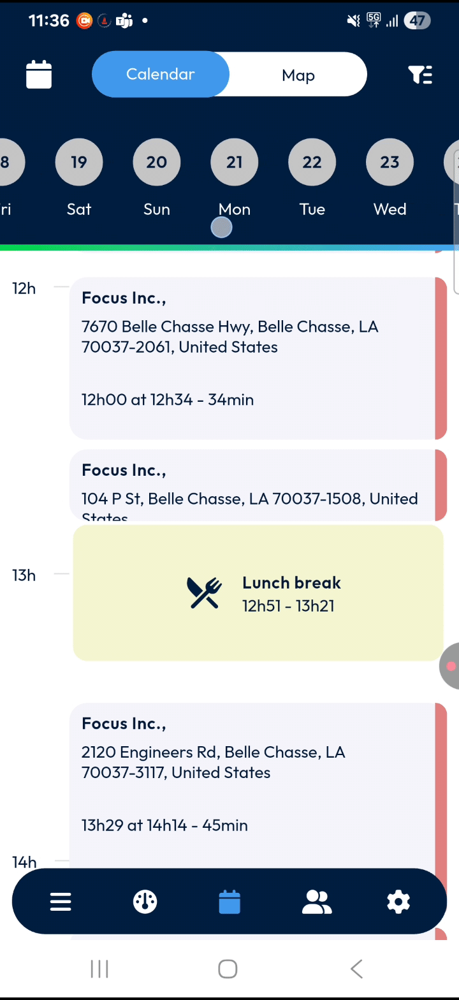
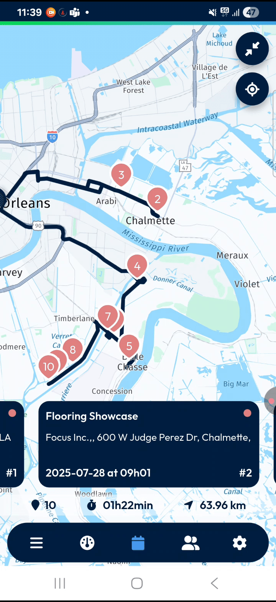

# MainActions-Calendar

Welcome to your user guide for **TourSolver Mobile/Calendar**! This guide is designed to help you quickly become proficient in managing your daily interventions, appointments, and tasks directly from your mobile device. With clear, step-by-step instructions and helpful tips, you'll be navigating your schedule with confidence in no time!

---

### 1. Getting Started with Your Calendar

The calendar screen is your central hub for viewing and managing all your planned activities, whether for today or in the future.

*   **System Requirements & Installation/Setup:**
    The provided sources do not specify system requirements or detailed installation/setup steps for the TourSolver Mobile app. Please refer to your organization's IT department or the app store listing for this information.

*   **Initial Configuration: Opening the Calendar**
    Your journey begins from the main dashboard of the app.
    1.  Look for the main action buttons at the **bottom** of your app screen.
    2.  **Tap** the **calendar button**.

        *   [Screenshot: Main dashboard with calendar button highlighted, then default daily calendar view]

---

### 2. Feature Explanations & Benefits

The TourSolver Mobile calendar offers powerful features to keep you organized and efficient.

*   **Daily View (Default):**
    *   **Benefit:** Provides an immediate overview of your current day's schedule, including customer interventions and events like lunch or briefings.
    *   **Details:** Displays interventions as **cards**. A horizontal red line shows the current timeline, helping you see where you are in your day.

*   **Date Selection:**
    *   **Benefit:** Allows you to easily view interventions for any specific date, past (if enabled) or future.
    *   **Details:** Accessed via the **calendar icon** at the top left of the calendar screen.

*   **Calendar View (Cards):**
    *   **Benefit:** Presents a clear, list-like view of all interventions for a selected date, detailing customer information and timings.
    *   **Details:** Each intervention is displayed as a **card**, showing the customer's name, address, start/end times, and duration. A small colored circle on the right indicates the intervention's current status. Events like "lunch break," "briefing," "loading," and "unloading" are also listed.

*   **Map View:**
    *   **Benefit:** Offers a visual overview of your daily route and the location of each intervention, helping you understand your travel plan.
    *   **Details:** Shows your start location and all interventions for the day, numbered in sequence. A route summary displays the number of interventions, total duration, and distance to travel. You can also see intervention cards alongside the map in full-screen mode.

*   **Filters and Display Options:**
    *   **Benefit:** Customize how you view your schedule, allowing you to switch between day, week, or list views, and access important actions.
    *   **Details:** Accessed via the **filter button** at the top right of the screen.

*   **Intervention Status Color Legend:**
    *   **Benefit:** Quickly understand the status of each intervention at a glance based on its color.
    *   **Details:** The color legend is accessible by tapping the **filter button**.
        *   **Red:** Awaiting status.
        *   **Light Red:** Accepted status (this is also indicated if a card says "your next visit" as your next action).
        *   **Yellow:** In progress.
        *   **Green:** Completed.
        *   **Dark Purple:** Refused.
        *   **Light Purple:** Abandoned.

---

### 3. Common Tasks

Here's how to perform key actions within the TourSolver Mobile Calendar.

**3.1. Changing the View Date**
To view your schedule for a different day:
1.  From the calendar screen, tap the **calendar icon** at the **top left**.

2.  The current month will be displayed with today's date highlighted.
3.  You have several options to pick another date:

    *   **Move to next month:** Tap the **right arrow** next to the month name to view future dates.

    *   **Select directly on calendar:** Tap any date on the displayed calendar.
        *   **Yellow circles** mark your selected date.
        *   **White circles** show days of the current week.
        *   **Gray circles** show days in the previous week.
4.  Once you've chosen your date, tap **OK** to confirm your selection or **Cancel** to close the pop-up without changing the date.

    *   [Screenshot: Date selection pop-up with arrows and pencil icon highlighted]

**3.2. Switching Between Calendar and Map Views**
You can choose how you want to visualize your interventions:
1.  At the top center of the screen, next to the calendar icon, you'll see two view icons.
2.  **Tap** the respective icon to switch:

    *   [Screenshot: Top bar with calendar icon and view selection icons highlighted]

**3.3. Using Filters and Display Options**
To refine your view or access actions:
1.  Tap the **filter button** at the **top right** of the screen.

2.  From this menu, you can:

    *   Access the **Color Legend** to understand intervention statuses.
    *   Under "Actions," find:

    *   [Screenshot: Filter menu open, showing view options and actions]

**3.4. Viewing Intervention Details in Card View**
1.  Once your filters are set, scroll down to see all your interventions for the selected date.
2.  Each intervention appears as a **card**.
3.  On each card, you'll see:
    *   The customer's **name** and **address**.
    *   Intervention **start and end times** and **duration**.
    *   A small **colored circle** indicating the current status (refer to the Color Legend in the filter menu).
        *   💡 **Tip:** If a card says "**Your next visit**," it signifies your immediate next action.
4.  To see more details and start a task, **tap** an intervention card.
    *   [Screenshot: Example intervention card with highlighted details]

**3.5. Exploring the Map View**
For a visual overview of your route:
1.  Tap the **map view icon** at the top center of the screen.
2.  The map will display:
    *   Your **start location**.
    *   Each intervention for the day, **numbered in order**.
    *   A **route summary** including the number of interventions, total duration, and distance to travel.
    *   Your **route drawn** on the map.
3.  **Full Screen Map View:**

    *   Swipe the cards **right or left** to view different interventions.
    *   Each card in this view shows the customer name, plan time, duration, sequence number, and status via a colored circle.

    *   [Screenshot: Map view with route and intervention locations]

**3.6. Returning to the Main Calendar Screen**
You can always return to the main calendar screen by tapping the **back arrow** at the **top left**.

---

### 4. Productivity Tips

💡 The calendar screen is designed to help you quickly see and manage interventions for any date, today or in the future.

*   **Stay Updated:** Regularly use the **"Update my agenda"** feature (found under the **filter button > Actions**) to ensure your calendar reflects the latest changes from your planner. This is crucial for accurate scheduling.
*   **Quick Search:** If you need to find a specific intervention, don't scroll endlessly! Use the **"Search for an intervention"** tool (also under **filter button > Actions**) to quickly locate it by typing a name, number, date, or address.
*   **Visual Planning:** Leverage the **Map View** to understand your daily route and the geographical distribution of your interventions. This can help you anticipate travel times and optimize your sequence of visits.
*   **Status at a Glance:** Familiarize yourself with the **color legend** for intervention statuses. This allows for rapid identification of accepted, in-progress, completed, or other statuses without needing to tap into each card.