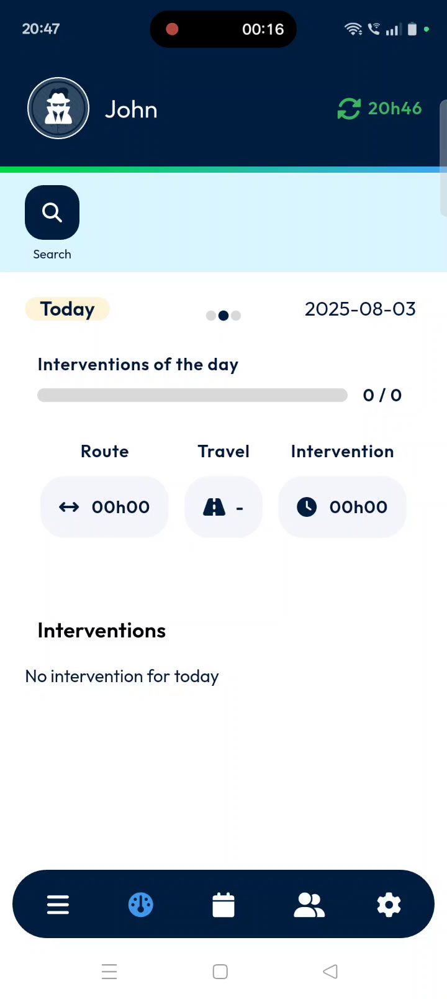
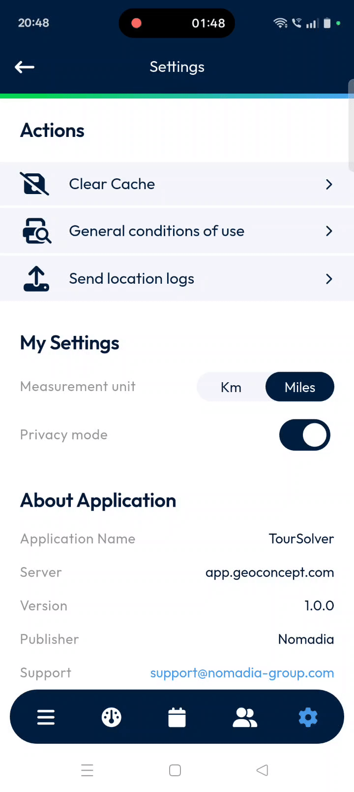
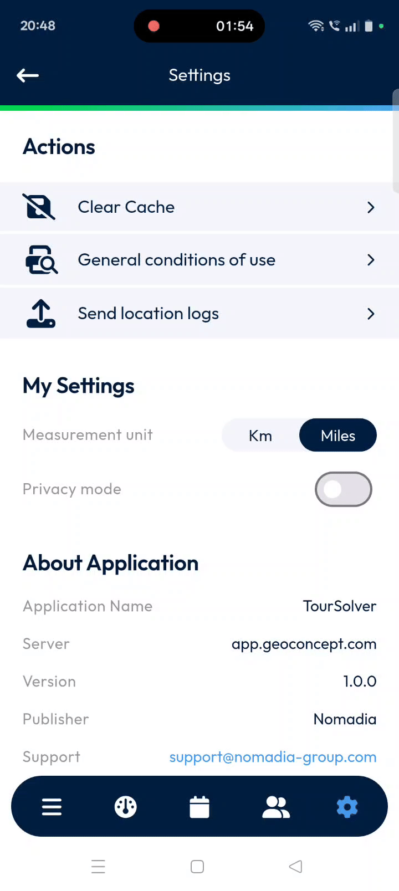

# MainActions-Settings

Welcome to your comprehensive guide for the **TourSolver Mobile App**'s Settings! This guide is designed to help you easily manage your app preferences, understand important information, and take control of your mobile experience. Whether you want to optimize performance, manage your privacy, or find support, the Settings tab is your central hub for customization and information. Let's dive in!

***

### Getting Started with Your Settings

While the provided sources do not specify the exact system requirements for the TourSolver Mobile App or its initial installation steps, this section will guide you through accessing and performing essential first configurations within the app's settings.

**1. Accessing the Settings Screen**
To access the settings:
1.  **Launch the TourSolver Mobile App**.
2.  Locate the **gear icon** on the bottom navigation bar.
3.  **Tap** the **gear icon**.

4.  You will now be on the **Settings screen**. Here, you'll find three main sections: **Actions**, **My Settings**, and **About Application**.
    *   *Imagine a screenshot here showing the main Settings screen with the three sections clearly labeled.*

**2. Initial Configuration (Important First Steps)**

*   **Set Your Preferred Measurement Unit**:
    1.  On the Settings screen, navigate to the **My Settings** section.
    2.  **Tap** the "measurement unit" option.
    3.  Choose your preferred unit by selecting either **Kilometer** or **Miles** based on your region or preference.

*   **Enable Privacy Mode for Data Control**:
    1.  On the Settings screen, also under **My Settings**, find the "Enable privacy mode" option.
    2.  **Toggle** this option to **limit the app's data collection**.
    3.  💡 **Tip**: Enabling privacy mode is a great way to ensure your personal information is handled according to **GDPR standards**, giving you full control over how your data is shared.

***

### Understanding Your App's Features (Settings Sections)

The Settings tab organizes valuable features into three easy-to-understand sections:

*   **Actions**: This section offers options to manage your app's performance and facilitate support.
    *   **Clear Cache**: This option helps your app run smoothly by removing temporary files.
        *   **Benefit**: Optimizes performance and refreshes outdated content, ensuring you always see the most current information.
    *   **General Conditions of Use**: Here, you can access and read the official legal notices, terms, and definitions that apply across the app.
        *   **Benefit**: Stay informed about your rights and responsibilities when using the app.
    *   **Send Location Logs**: This feature allows you to securely send your location history directly to the support team.
        *   **Benefit**: Essential for troubleshooting or diagnostic purposes if you encounter any issues that require technical assistance.

*   **My Settings**: This section allows you to personalize your app experience.
    *   **Measurement Unit**: Choose your preferred unit for distance measurements.
        *   **Benefit**: Customize the app to display distances in either **kilometers** or **miles**, making it more convenient and familiar for you.
    *   **Privacy Mode**: Control how your personal data is collected by the app.
        *   **Benefit**: By enabling this, you align the app's data processing with **GDPR standards**, ensuring you have full control over your personal information and how it's shared.

*   **About Application**: This section provides essential technical information about the TourSolver Mobile App.
    *   **Application Name**: The app is called **TourSolver**.
    *   **Server**: It syncs data using the server `apps.concept.com`.
    *   **Version**: Displays the current version installed, for example, `1.0.0`.
    *   **Publisher**: The app is developed and published by **Nomadia**, a recognized leader in smart mobility solutions.
    *   **Support**: Provides the support email address: `support@nomadiagroup.com` for any assistance.
    *   **Website**: Gives the official website address: `www.nomadiagroup.com` for more information.
        *   **Benefit**: Quickly find important details about the app, including contact information for support, which is useful for troubleshooting or inquiries.

***

### Common Tasks in Settings

Here are step-by-step instructions for common actions you might want to perform in the Settings tab:

*   **How to Clear the App's Cache**:
    1.  From the Settings screen, tap on **Clear Cache** under the **Actions** section.
    2.  A confirmation pop-up will appear, asking "Are you sure you want to clear the cache of your application?"

    3.  To proceed, simply tap **Confirm**.
        *   **Benefit**: This action helps keep your app running smoothly by removing temporary files and refreshing content.
        *   💡 **Tip**: Regularly clearing your cache can prevent performance issues and ensure you're always viewing the most up-to-date information in the app.

*   **How to Read the General Conditions of Use**:
    1.  On the Settings screen, tap on **General Conditions of Use** under the **Actions** section.
    2.  You will be taken to a new screen where you can read the full legal notices, terms, and definitions.

    3.  To return to the Settings screen, tap the **back button** located in the top left corner of your screen.

*   **How to Send Location Logs to Support**:
    1.  From the Settings screen, tap on **Send Location Logs** under the **Actions** section.
    2.  After tapping, a confirmation message will appear, indicating that "the logs were sent successfully."

        *   💡 **Tip**: This feature is specifically designed for **troubleshooting or diagnostic purposes**. Only send logs if you are experiencing an issue and have been advised by the support team to do so.

*   **How to Change Your Measurement Unit**:
    1.  From the Settings screen, locate the **My Settings** section.
    2.  Tap on the option for **measurement unit**.
    3.  Choose your preferred unit by selecting either **Kilometer** or **Miles** based on your region or preference.

*   **How to Enable Privacy Mode**:
    1.  From the Settings screen, locate the **My Settings** section.
    2.  Find the option "Enable privacy mode."
    3.  **Toggle** the switch next to this option to turn it **on** (to limit data collection) or **off**.

        *   💡 **Tip**: Enabling privacy mode helps the app comply with **GDPR standards**, giving you more control over your personal information.

***

### Productivity Tips for TourSolver Mobile App Settings

*   **Regular Cache Clearing**: Make it a habit to **Clear Cache** periodically. This keeps your app fast and responsive, preventing slowdowns from accumulated temporary files.
*   **Data Control**: Take advantage of the **Privacy Mode**. If data privacy is a concern, enabling this feature gives you greater control over how your information is handled, aligning with international privacy standards.
*   **Quick Support Access**: If you encounter any technical issues, remember that the **Send Location Logs** feature can be a quick way to provide essential diagnostic information to the support team. You can also find the **support email address** and **website** under "About Application" for direct assistance.
*   **Stay Informed**: Periodically review the **General Conditions of Use** to stay updated on any legal notices or terms that govern your use of the app.

Staying in control of your preferences and application settings is key to a smooth experience with the TourSolver Mobile App. We hope this guide helps you feel confident and empowered while using the app!