# MainActions-Package-Loading and Unloading

Welcome to the **TourSolver Mobile App: Package-Loading and Unloading User Guide**! This guide is designed to help you confidently manage package deliveries and returns using the app, making your daily tasks smoother and more efficient. We'll walk you through the key features with simple, step-by-step instructions.

---

### **1. Getting Started**

The TourSolver Mobile App is designed for easy navigation. This section helps you locate the package management features and understand their basic indicators.

#### **Locating Your Packages**

Your journey begins on the app's dashboard.

#### **Accessing the Packages Section**

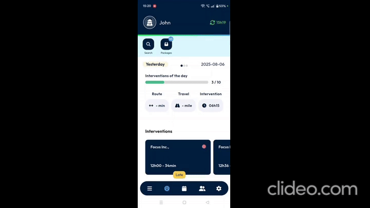

---

### **2. Feature Explanations**

Once inside the Packages section, you'll find powerful tools to manage your packages.

#### **Loading and Unloading Tabs**

At the top of the Packages section, you'll see two main tabs: **Loading** and **Unloading**.

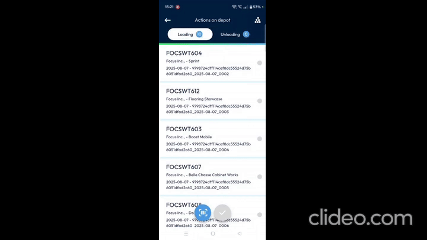

    *   Timestamp 2:46–2:51 (Package-Loading and Unloading.mp4): Feature – Unloading tab also used for parcels picked up from customers.

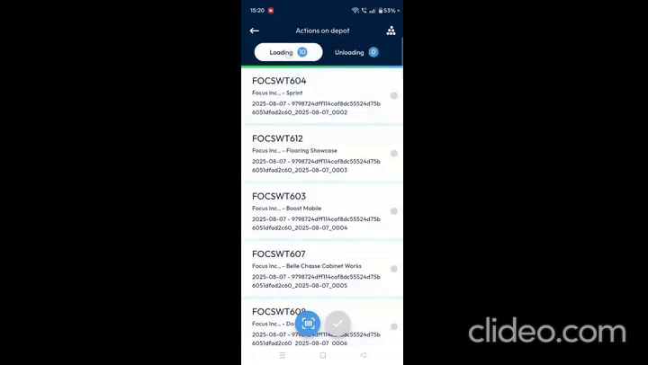

#### **Understanding Parcel Status**

The app uses colors to quickly show you the status of your parcels.

 at top right.")

3.  **Color Meanings**:
    *   **Blue**: Indicates packages that have been **loaded**.
    *   **Red**: Indicates packages that were **not collected**.

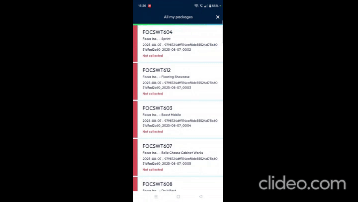

---

### **3. Common Tasks**

This section provides detailed steps for the most common tasks you'll perform in the Package-Loading and Unloading module.

#### **3.1 Managing Packages in the Loading Tab**

The Loading tab is where you manage packages scheduled for delivery.

1.  **Viewing Package Details**:
    *   In the **Loading tab**, you can see important details on each package card, such as the loaded date and time, the package name, and customer information.

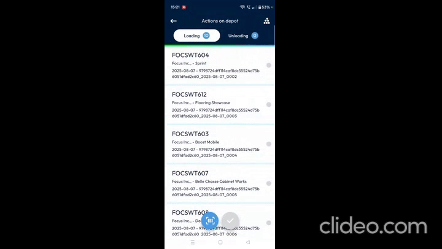

2.  **Scanning a Barcode**:
    *   This is the primary way to confirm a package's status.

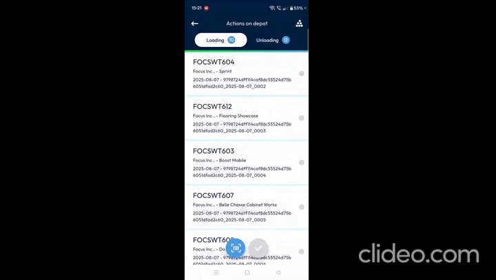

    2.  Position your device to scan the package's barcode.

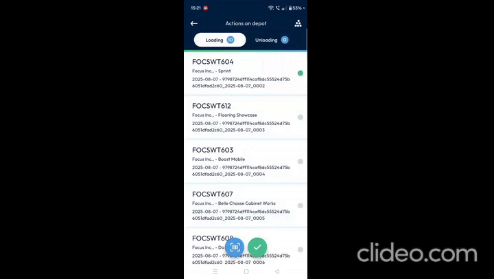

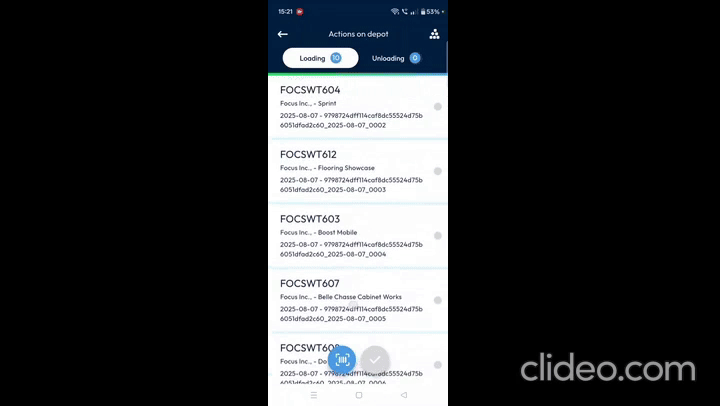

3.  **Using the Flashlight (Torch Icon)**:
    *   If a barcode is hard to see due to poor lighting or is invisible, you can turn on your device's flashlight.

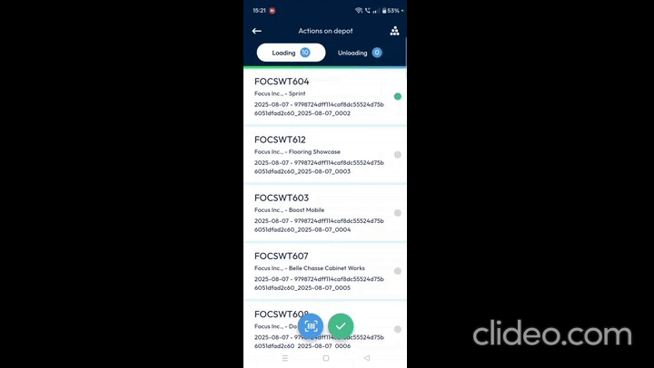

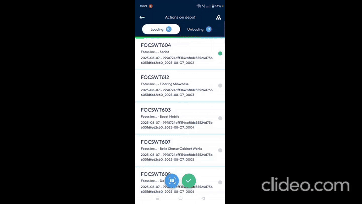

4.  **Manually Entering a Barcode (Keyboard Icon)**:
    *   If a barcode is damaged and cannot be scanned, you can manually enter its code.

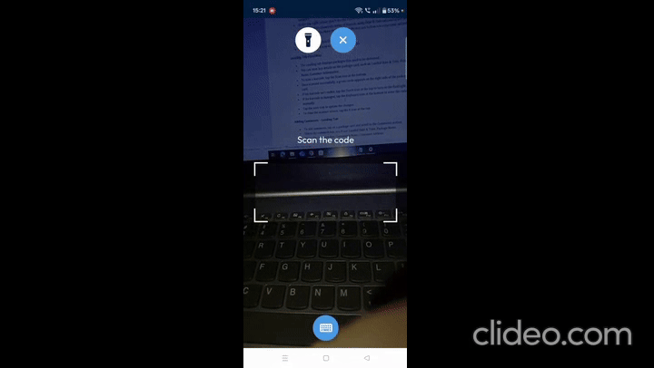

    2.  Enter the barcode number using the keyboard that appears.

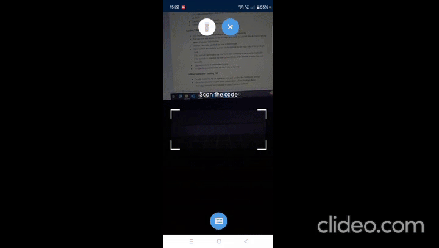

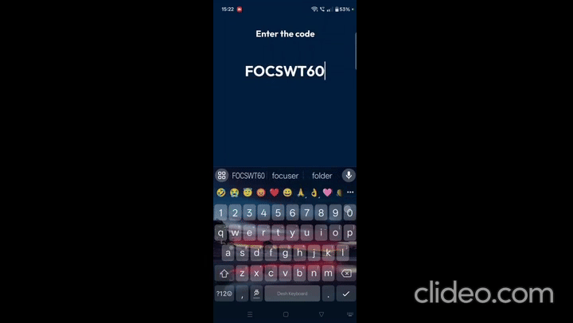

5.  **Adding Comments to a Package**:
    *   You can add notes or comments to a package, which can be useful for providing additional information.
    1.  Tap on a specific **package card** in the **Loading tab**.
    2.  Scroll down to the **comment section**.
    3.  Tap on the text box within the comment section to enter your comments.
        *   *Screenshot/Diagram Suggestion*: A screenshot of the comment section with the package details (loaded date/time, package name above; customer name/address below) would be helpful here.
    4.  You'll see details like loaded date and time, and package name above the comment box. Below it, you'll find the customer name and customer address.

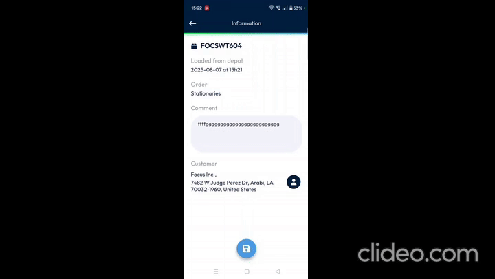

#### **3.2 Managing Packages in the Unloading Tab**

The Unloading tab is used for processing packages returned to the warehouse or picked up from customers.

1.  **Scanning Returned Packages**:
    *   The process for scanning returned packages is very similar to scanning for loading.

    2.  Scan the returned package's barcode.

        *   💡 **Tip**: The **Torch icon** (flashlight) and **Keyboard icon** (manual entry) function exactly the same way in the Unloading section as they do in the Loading section.

2.  **Adding Comments to an Unloaded Package**:
    *   You can add comments to provide context for a returned or picked-up package.

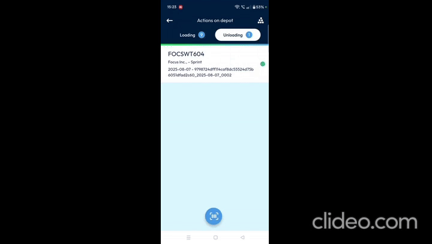

    2.  Enter your comments in the **comment box**.
        *   *Screenshot/Diagram Suggestion*: A screenshot of the comment box for unloading, showing loaded/unloaded date and time, package name, customer name, and customer address.
    3.  You will also see important details such as loaded and unloaded date and time, package name, customer name, and customer address.

3.  **Adding Photos for Unloaded Packages**:
    *   Attaching photos can provide visual proof or additional information about a package's condition or reason for return.

    2.  A pop-up will appear with three options: **Take a photo**, **Choose an image**, or **Cancel**.

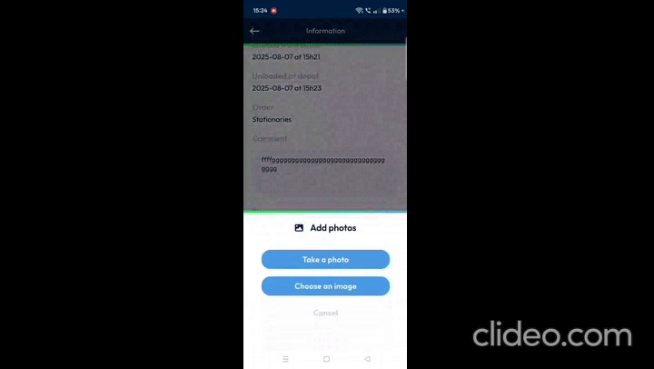

    3.  **To Take a Photo (Capture Manually)**:

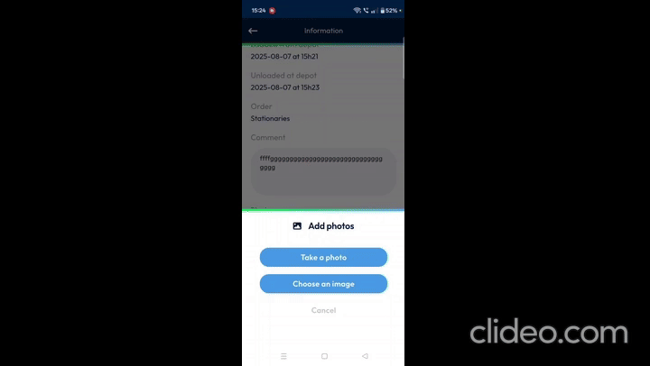

        2.  Tap the **Camera icon** at the bottom to snap the picture.

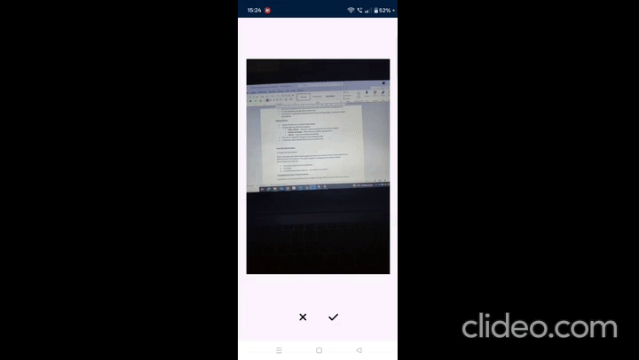

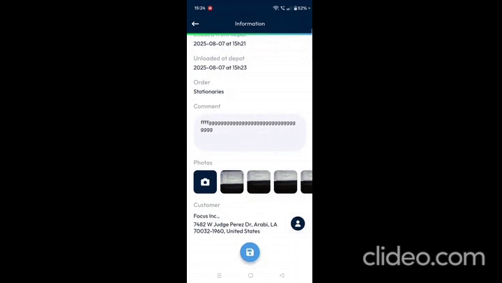

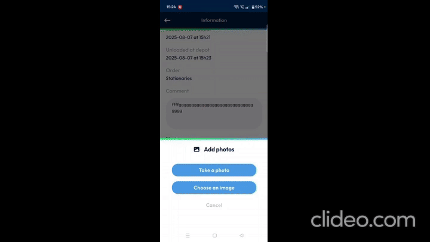

    4.  **To Choose an Image (Upload from Gallery)**:

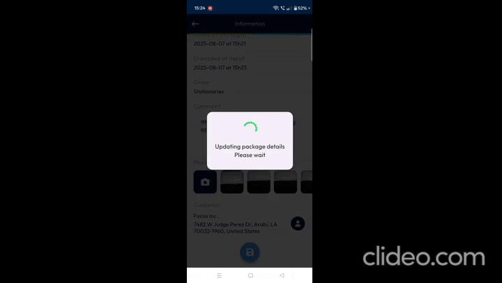

        2.  Select the desired image from your device's gallery.

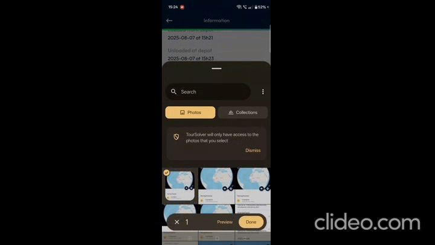

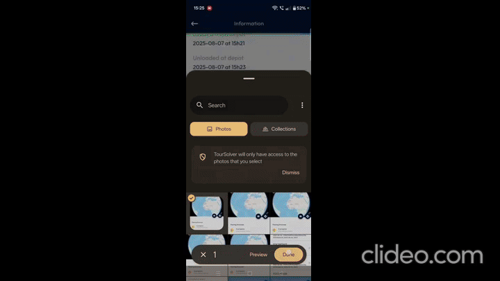

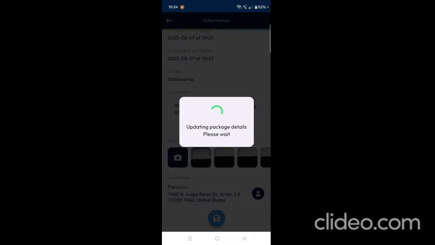

    5.  **To Cancel Adding a Photo**:

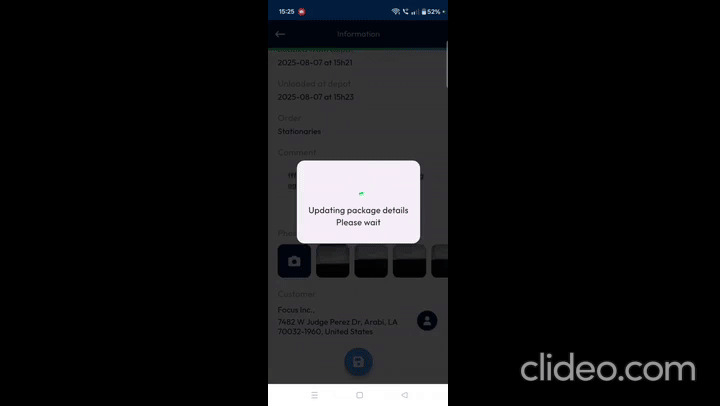

    6.  **Exiting Photo/Unloading Screens**:

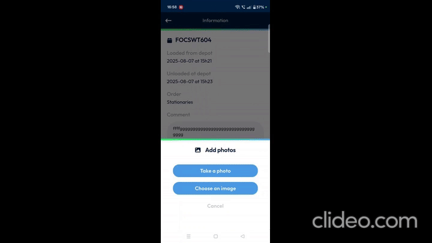

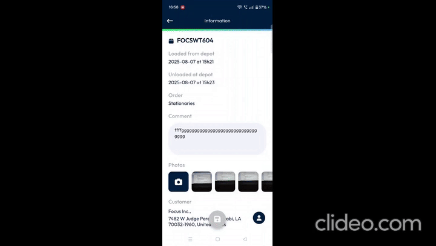

---

### **4. Productivity Tips**

Here are some tips to help you get the most out of the TourSolver Mobile App:

*   💡 **Confirm Scans Instantly**: Always look for the **green circle** on the package card after scanning. This quickly confirms a successful scan, saving you time.
*   💡 **Use the Flashlight Wisely**: If you're in a dimly lit area or dealing with a faded barcode, don't hesitate to use the **Torch icon** to enable your flashlight. It can save you from manual entry.
*   💡 **Know When to Manually Enter**: For severely damaged barcodes, the **Keyboard icon** is your best friend. It ensures you can still process the package accurately even if a scan isn't possible.
*   ⚠️ **Always Save Your Changes**: Whether you're entering a barcode manually or adding photos, remember to tap the **Save button** to ensure your updates are recorded. Forgetting to save means your work won't be applied!
*   💡 **Navigate Efficiently**: Use the **X icon** to quickly exit pages and the **Back button** to return to previous screens. Knowing these navigation tools will make your workflow smoother.
*   💡 **Add Comments for Clarity**: Utilize the comment sections for both loading and unloading packages. This is a great way to record specific details, customer requests, or reasons for returns, providing valuable context for yourself and others.

We hope this guide builds your confidence and helps you succeed with the TourSolver Mobile App!