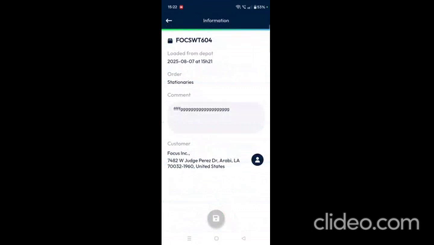

# Loading-Unloading

Welcome to the **ToolSolver Mobile App**! This comprehensive user guide is designed to help you easily navigate and effectively use the **Loading-Unloading** functions of your mobile app. We're here to make your daily package management smooth and efficient, whether you're loading items for delivery or processing returns.

***

## Getting Started

To begin using the Loading-Unloading features, you'll first need to access the correct section of the app.

### Accessing the Packages Section

1.  On your dashboard, **locate the Packages icon** at the top left corner of your screen.

### Navigating Between Loading and Unloading Tabs

Within the Packages section, you can switch between two main functions: Loading and Unloading.

2.  **Tap** on the desired tab (**Loading** or **Unloading**) to switch between them.

### Understanding Parcel Statuses

To get a quick overview of your parcels' status, look for the **Parcel icon**.

⚠️ **Important**: This guide focuses on the app's functionality based on the provided sources. Information regarding system requirements, installation, or initial setup steps are not available in the given material. You may need to consult other documentation for those details.

***

## Understanding Loading and Unloading

The ToolSolver Mobile App helps you manage packages for delivery and returns efficiently.

### Loading Tab Functions

The **Loading** tab is where you manage packages that need to be delivered to customers.

*   You can view essential details for each package directly on its **package card**, such as:
    *   **Loaded date and time**
    *   **Package name**
    *   **Customer information**

### Unloading Tab Functions

The **Unloading** tab is used for two main purposes:

*   Displaying packages that have been **returned to the warehouse** (for example, due to customer unavailability).
*   Managing parcels that you have **picked up from a customer**.
*   On an intervention card in the Unloading tab, you can view:
    *   **Loaded and unloaded date and time**
    *   **Package name**
    *   **Customer name**
    *   **Customer address**

***

## Common Tasks and How to Perform Them

Here are detailed steps for common tasks you'll perform in the app.

### 1. Scanning Barcodes (Loading & Unloading)

Scanning barcodes is a primary way to manage packages in both the Loading and Unloading tabs.

2.  **Scan** the package barcode.

    *   *A screenshot here would show a package card with a green circle on the right side.*

    💡 *Tip*: If the barcode is **invisible** or hard to read:

    ⚠️ *Warning*: If the barcode is **damaged** and cannot be scanned:

    *   *A screenshot here would show the manual barcode entry screen.*

: Tap X icon – Scanning page closes.")

### 2. Adding Comments

You can add important notes or details to package information in both Loading and Unloading sections.

: Tap intervention card – Intervention details open.")

2.  **Scroll** to the **comments section**.

    *   When adding comments, you will also see key details like **loaded date and time, package name, customer name, and customer address** (and unloaded date and time in the Unloading tab).
    *   *A screenshot here would show the comments section with package details above and below the comment box.*

### 3. Adding Photos (Unloading Tab Only)

You can add images of packages, especially useful for returned or picked-up items in the Unloading tab.

#### Option A: Taking a New Photo

#### Option B: Choosing an Existing Image from Your Gallery

#### Option C: Cancelling Without Uploading

: Tap Back button – Exits unloading page.")

***

## Productivity Tips

*   **Quick Status Check**: Always check the **Parcel icon's color** (blue, red, yellow) for a fast overview of your parcel statuses without needing to open each package card.
*   **Use Flashlight for Tricky Barcodes**: Don't waste time trying to scan in poor lighting. The **Torch icon** is there to help!
*   **Manual Entry for Damaged Codes**: If a barcode is unreadable, use the **Keyboard icon** to manually enter the code quickly and avoid delays.
*   **Add Comments and Photos**: For returned or picked-up packages, detailed comments and photos can be crucial for record-keeping and avoiding future issues.

***

We hope this user guide helps you feel confident and capable while using the **ToolSolver Mobile App** for all your loading and unloading needs!