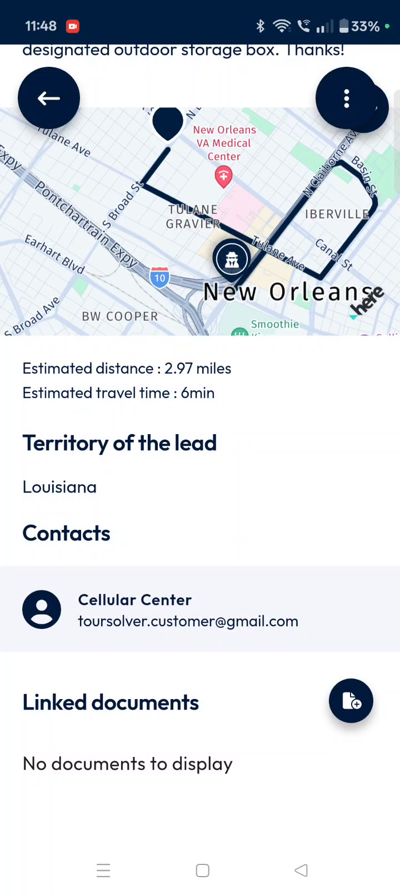

# Sites&Leads-Leads

Welcome to the **Sites & Leads** user guide for the **ToolSolver Mobile application**! This guide is designed to help you efficiently access and explore customer leads, empowering you to stay organized, efficient, and informed during your daily field operations. Whether you're a new user or looking to master advanced features, this guide will walk you through everything you need to know.

### Getting Started

The ToolSolver Mobile application's **Sites & Leads** feature simplifies managing customer information and optimizing your field tasks.

*   **System Requirements:** The provided sources do not specify system requirements for the ToolSolver Mobile application.
*   **Installation/Setup Steps:** The provided sources do not include steps for installing or setting up the ToolSolver Mobile application.
*   **Initial Configuration:** The sources indicate that **leads are secondary customer locations already stored in the database**. They can have records that are either assigned or not assigned to your current route. The application automatically optimizes routes, so the distance shown is for information only, not for further optimization.

### Feature Explanations with Benefits

The **Sites & Leads** feature offers a robust way to manage customer interactions:

*   **Customer Leads**: These are secondary customer locations already saved in your database. They provide a comprehensive list of all customer orders.
*   **Detailed Order Cards**: Each customer order card displays essential information at a glance, including the customer’s name, address, email ID, phone number, and current location.
*   **Real-time Updates**: When you tap on a customer card, you can access detailed information that includes real-time updates of the customer's order, location, and any specific preferences like delivery instructions. You’ll also see estimated distance, estimated travel time, the territory of the lead, contacts, and linked documents.
*   **Optimized Routes**: The application comes with routes that are already optimized, meaning the displayed distance is purely for your information.
*   **Efficient Field Operations**: Features like smart filters and integrated navigation are designed to support your daily tasks, helping you stay organized, efficient, and well-informed.

### Common Tasks with Detailed Steps

This section will guide you through the most frequent tasks you’ll perform within the **Sites & Leads** feature.

#### Accessing Sites and Leads

To begin, you need to access the main Sites & Leads section from your dashboard.
1.  From the dashboard, **tap** on the **Sites and Leads** button located at the bottom of the screen, next to the Calendar tab.
2.  Next, **tap** the **Leads** option, which is located next to the Sites tab.

#### Viewing and Interacting with Customer Cards

Each customer order is presented as a card with key information.
1.  To view detailed information, **tap directly on any customer card**.

    💡 **Tip**: This detailed view provides crucial context for your visit, from special delivery notes to contact information.

#### Adding Customer Photos

You can add photos to a customer's record, either by taking a new picture or uploading one from your gallery.
1.  **Tap** the **photo icon** on the right side of the screen.
2.  To take a new photo:
    *   **Tap** the **camera icon** at the bottom.
    *   Take the snap.
    *   **Tap** the **tick mark** at the bottom to upload the image.
    *   **Tap** the **save icon** at the bottom to update the changes.
3.  To upload from your gallery:
    *   **Tap** the **photo icon** next to the camera icon.
    *   **Select a photo** from your gallery.
    *   **Tap Done** to upload the image.

    📹 **Timestamp 1:36–1:53** (Sites&Leads-Leads.mp4): Uploading from Gallery – Photo is added from gallery and saved.
    💡 **Tip**: Adding photos can be useful for documenting site conditions or delivery confirmations.

#### Relocating a Customer Site

If a customer's coordinates need updating to your current position, you can do so easily.
1.  **Tap** the **three-dot menu** at the top right corner of the screen.
2.  From the pop-up options, **select Relocate**.
3.  A confirmation message will appear. **Tap Confirm** to proceed.

    ⚠️ **Warning**: Confirming this action will permanently update the customer’s coordinates in the database. Ensure you are at the correct location.

#### Copying Customer Details

You can quickly copy customer details for easy sharing.
1.  **Tap** the **copy button** located just below the photo icon.

#### Sending Customer Details to Another Device

You can share customer details with another person using a QR code.
1.  After copying the customer details, **tap Send to device**.
2.  **Tap Use QR code**.

#### Navigating Using Maps

The application integrates with navigation apps like Google Maps for seamless driving directions.
1.  **Tap** on the **navigation button** located below the copy button.
2.  The app will offer available navigation options, such as **Google Maps**.
3.  **Select Google Maps**.

    💡 **Tip**: This feature saves time by directly launching navigation with pre-filled addresses.

#### Linking Documents

You can link important documents to a customer's record, either by taking a photo of the document or uploading from a folder.
1.  **Tap** the **document icon** next to "linked documents".
2.  To take a photo of a document:
    *   **Tap** the **camera icon** at the bottom.
    *   Take the snap.
    *   **Tap** the **tick mark** at the bottom to upload the image.
    *   **Tap** the **save icon** at the bottom to update the changes.
3.  To upload a document from a folder:
    *   **Tap** the **photo icon** next to the camera icon.
    *   **Select Documents**.
    *   **Tap Confirm** to proceed.
    *   **Select a document** from the folder.

    📹 **Timestamp 3:34–3:53** (Sites&Leads-Leads.mp4): Uploading Document from Folder – Document is uploaded and saved.
    💡 **Tip**: Linking documents helps keep all relevant information for a customer in one place.

#### Switching Between List and Map Views

You can switch between two views to best suit your needs:
1.  To see customer sites visually on a map, **tap the map icon**.
    *   **Result**: The app displays customer locations on a map.
2.  To view a detailed summary of customer information, **tap the list icon**.

#### Searching for Customers

Quickly find specific customer entries using the search bar.
1.  **Tap** the **search icon** below the map icon.
2.  **Use the search bar** to find entries by customer's name, address, or address type.
3.  **Select the address** from the drop-down list.
    *   **Result**: The address results will display.

#### Displaying Nearby Sites ("Around Me")

See customer sites close to your current location on the map.
1.  **Tap** the **Around Me button** to display nearby sites on the map.
2.  You can **zoom in and zoom out** to view the customer's location more closely.

#### Filtering by Distance or Time

Narrow down your customer list based on proximity or travel time.
1.  **Tap** the **Filter option** below the search icon.
2.  You can narrow the list by setting a **maximum distance in miles** or **travel time in minutes**.
    *   **Example**: You can filter to show only customers within a 4.35-mile radius or up to 15.53 miles, based on your service range.
3.  After entering your criteria, **tap the save button** to apply the changes.

    💡 **Tip**: This filter helps you prioritize visits or plan routes more effectively by focusing on customers within a manageable range.

### Productivity Tips

*   **Utilize Filters**: Use the distance and time filters to efficiently narrow down your customer list, helping you focus on the most relevant leads for your current service range.
*   **Leverage Map View**: Switch to the map view to visually understand customer locations and their proximity to your current position, especially when using the "Around Me" feature.
*   **Keep Records Updated**: Regularly add customer photos and link documents to ensure all customer information is comprehensive and up-to-date, supporting better service.
*   **Seamless Navigation**: Always use the integrated navigation feature to save time and ensure you have the most optimized directions to your customer sites.

The ToolSolver Mobile application's Sites & Leads feature is designed to empower your daily field operations, helping you stay organized, efficient, and well-informed. We hope this guide helps you make the most of its powerful capabilities!